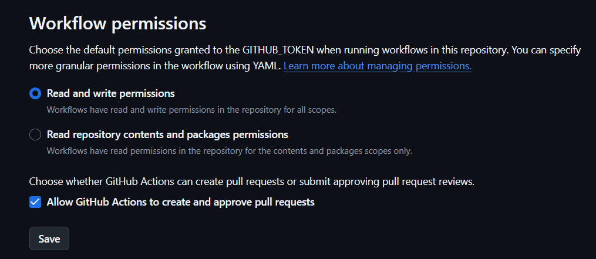
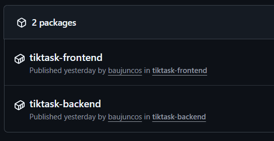
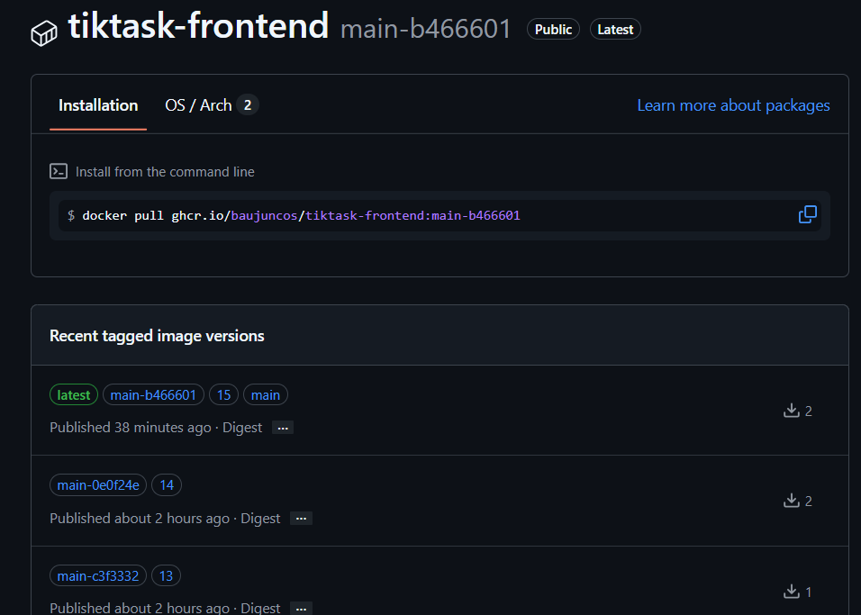
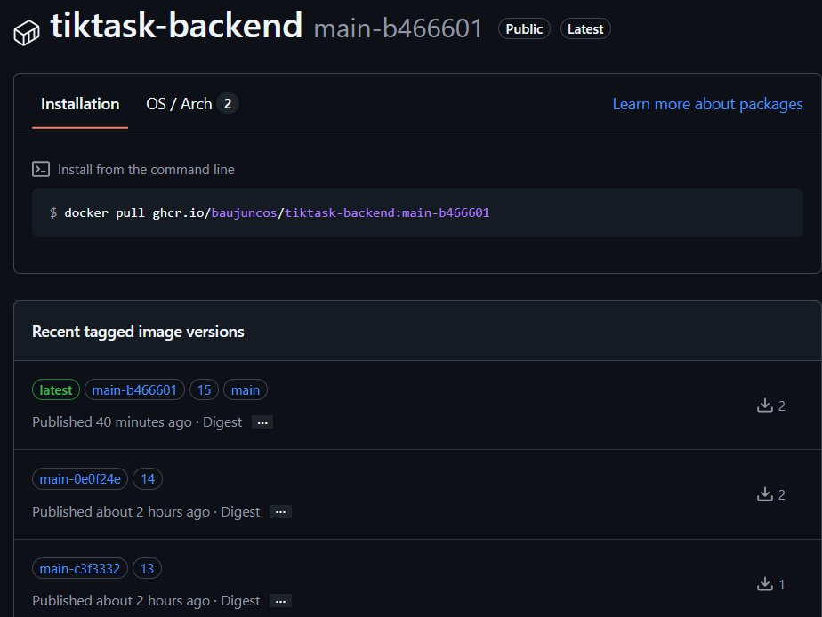
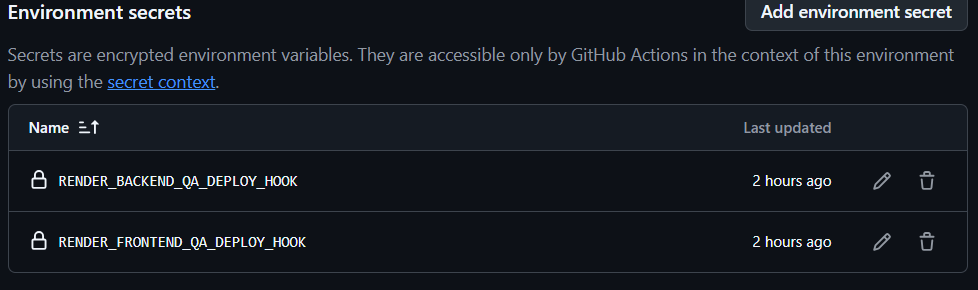
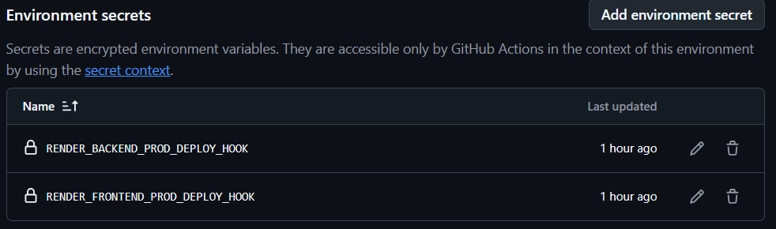
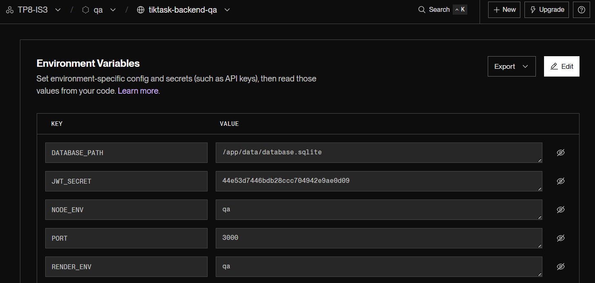
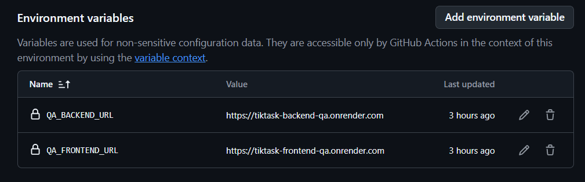

# TP8: Cloud Containers

### Alumnos: Juncos Bautista y Treachi Belén.

## Stack Tecnológico Elegido

### Aplicación: TikTask

**Lenguajes y Frameworks:**
- **Backend**: Node.js + Express
- **Base de datos**: SQLite
- **Frontend**: HTML/CSS/JavaScript vanilla + Nginx

**Justificación:**
- **Node.js**: Runtime ligero y eficiente para APIs REST, ampliamente soportado
- **Express**: Framework minimalista que permite control total sin complejidad innecesaria
- **SQLite**: Base de datos embebida perfecta para este caso de uso, sin necesidad de servidor separado
- **Frontend vanilla**: Sin dependencias de build complejos, rápido de servir con Nginx
- **Nginx**: Servidor web extremadamente eficiente para archivos estáticos y proxy reverso

---

## Contenedores Docker

### Backend Dockerfile (`backend/Dockerfile`)

**Características:**
- Base: `node:18-alpine` (imagen pequeña y segura)
- Multi-stage build para optimización
- Usuario no-root (`node`) para seguridad
- Health check en `/api/health`
- Volúmenes para datos persistentes

### Frontend Dockerfile (`frontend/Dockerfile`)

**Características:**
- Base: `nginx:alpine`
- Sirve archivos estáticos eficientemente
- Proxy de API requests a backend
- Health check configurado
- Configuración nginx optimizada

### Docker Compose (`docker-compose.yml`)

**Servicios:**
- **backend**: API Node.js en puerto 3000 (interno)
- **frontend**: Nginx en puerto 80 (expuesto)

**Para probar localmente:**
```bash
docker-compose up --build
```

Acceder en: http://localhost

---

## Servicios Cloud Elegidos

### Container Registry: GitHub Container Registry (GHCR)

**Justificación:**
- **Gratuito**: Sin límites para repositorios públicos
- **Integrado con GitHub**: Autenticación automática con `GITHUB_TOKEN`
- **CI/CD nativo**: Perfecta integración con GitHub Actions
- **Rendimiento**: CDN global, descargas rápidas desde cualquier región
- **Sin configuración adicional**: Ya está disponible para cualquier repositorio de GitHub

**Alternativas consideradas:**
- Docker Hub: Requiere autenticación separada, límite de rate limiting
- GitLab Container Registry: Requeriría migrar el repositorio
- AWS ECR: Costos adicionales, más complejo de configurar

#### Habilitar GitHub Container Registry



---

### Hosting: Render.com

**Justificación:**
- **Free tier generoso**: Suficiente para QA environment
- **Soporte nativo de Docker**: Deploy directo desde container registry
- **Deploy hooks**: Integración fácil con CI/CD
- **SSL automático**: Certificados HTTPS gratis
- **Sin tarjeta de crédito para free tier**: Barrera de entrada baja
- **Health checks automáticos**: Monitoreo incluido
- **Logs centralizados**: Fácil debugging

**Alternativas consideradas:**
- AWS App Runner: Más caro, requiere configuración de VPC/networking
- Azure Container Instances: Requiere créditos estudiantiles, más complejo
- Google Cloud Run: Free tier más limitado, cold starts más lentos
- Heroku: Plan free discontinuado
- Railway: Límite de horas muy restrictivo en free tier

---

### CI/CD: GitHub Actions

**Justificación:**
- **Gratuito para repositorios públicos**: 2000 minutos/mes en privados
- **Integrado con el repositorio**: No requiere herramienta externa
- **Marketplace extenso**: Acciones pre-construidas para Docker, GHCR, etc.
- **Environments nativos**: Soporte para QA/PROD con approvals
- **Secrets management**: Gestión segura de credenciales
- **Matrix builds**: Facilita construcción de múltiples imágenes

**Alternativas consideradas:**
- GitLab CI/CD: Requeriría migrar repositorio
- Azure Pipelines: Más complejo, requiere configuración adicional
- CircleCI: Créditos limitados, configuración más compleja

---

## Decisión: QA vs PROD

### Mismo servicio (Render), configuración diferente

**Decisión tomada:** Usar Render tanto para QA como para PROD, pero con diferentes planes y configuraciones.

**Justificación:**

#### Ventajas de usar el mismo servicio:
- **Paridad de ambiente**: QA y PROD funcionan exactamente igual, reduciendo el riesgo de "funciona en mi máquina"
- **Mismo stack de deployment**: Un solo tipo de configuración que aprender
- **Troubleshooting más fácil**: Los problemas en QA se comportan igual que en PROD
- **Menor complejidad**: No hay que mantener dos tipos diferentes de infraestructura
- **Deploy hooks consistentes**: Mismo mecanismo de deployment

#### Diferenciación entre ambientes:

| Aspecto | QA | PROD |
|---------|----|----- |
| **Plan** | Free | Starter ($7/mes por servicio) |
| **Auto-deploy** | ON | OFF (manual approval) |
| **Recursos** | Limitados (512MB RAM) | Mejores (1GB+ RAM) |
| **Sleep mode** | Sí (después de inactividad) | No |
| **Variables ENV** | `NODE_ENV=qa` | `NODE_ENV=production` |
| **Propósito** | Testing, validación | Usuario final |

#### Estrategia de segregación:
1. **Infraestructura**: 4 servicios totalmente separados (2 frontend + 2 backend)
2. **Datos**: Bases de datos independientes (discos separados)
3. **URLs**: Dominios diferentes (`*-qa.onrender.com` vs `*-prod.onrender.com`)
4. **Deployment**: QA automático, PROD con approval gate

---

## Arquitectura de Contenedores

### Decisión: 2 Imágenes Docker (Frontend + Backend separados)

**Justificación:**

#### Por qué separar Frontend y Backend:
- ✅ **Escalado independiente**: Frontend y backend pueden escalar por separado según demanda
- ✅ **Deployment independiente**: Cambios en frontend no requieren rebuild del backend y viceversa
- ✅ **Menor tamaño de imágenes**: Cada imagen contiene solo lo necesario
- ✅ **Mejor separación de concerns**: Frontend sirve archivos estáticos, backend maneja lógica de negocio
- ✅ **Flexibilidad**: Podríamos mover solo el frontend a un CDN en el futuro

#### Por qué NO monolito (backend sirviendo frontend):
- ❌ **Acoplamiento**: Cambios en uno afectan al otro
- ❌ **Recursos desperdiciados**: Backend necesita más recursos que frontend
- ❌ **Complejidad**: Mezcla responsabilidades de servir estáticos con lógica de negocio

### Decisión: Mismas imágenes para QA y PROD

**Justificación:**
- **Principio "Build once, deploy many"**: Garantiza que lo que se prueba en QA es exactamente lo que va a PROD
- **Reducción de riesgo**: No hay diferencias entre builds que puedan causar bugs en PROD
- **Eficiencia**: Una sola construcción de imagen, múltiples deployments
- **Versionado simple**: Tags únicos (SHA, run_number) identifican exactamente qué código está en cada ambiente
- **Rollback sencillo**: Fácil volver a una versión anterior cambiando el tag

#### PACKAGES







---

## Configuración de Recursos

Aclaración: hay ciertas configuraciones donde se debió optar por la versión gratis pero que su mejor práctica es una mejor (la plasmada a continuación)

### QA Environment

**Backend QA:**
```
Plan: Free
RAM: ~512MB
CPU: Shared
Instances: 1
Disk: 1GB (para SQLite)
Auto-sleep: Sí (después de 15min inactividad)
```

**Frontend QA:**
```
Plan: Free
RAM: ~512MB
CPU: Shared
Instances: 1
Auto-sleep: Sí
```

**Justificación para QA:**
- Es un ambiente de testing, no necesita alta disponibilidad 24/7
- Free tier es suficiente para pruebas y validación
- Sleep mode es aceptable (primera request tarda ~30seg en despertar)

### PROD Environment

**Backend PROD:**
```
Plan: Starter ($7/mes)
RAM: 1GB
CPU: Dedicated
Instances: 1 (puede escalarse)
Disk: 1GB (para SQLite)
Auto-sleep: No
Health checks: Cada 30s
```

**Frontend PROD:**
```
Plan: Starter ($7/mes)
RAM: 1GB
CPU: Dedicated
Instances: 1
Auto-sleep: No
Health checks: Cada 30s
```

**Justificación para PROD:**
- Usuarios finales requieren disponibilidad 24/7
- Sin auto-sleep: respuesta inmediata
- Más recursos: mejor performance
- Health checks: detección temprana de problemas
- Puede escalarse horizontalmente si hay más carga

---

## Gestión de Secretos

### GitHub Secrets (4 deploy hooks)
```
RENDER_BACKEND_QA_DEPLOY_HOOK
RENDER_FRONTEND_QA_DEPLOY_HOOK
RENDER_BACKEND_PROD_DEPLOY_HOOK
RENDER_FRONTEND_PROD_DEPLOY_HOOK
```

**Justificación:**
- URLs sensibles que no deben estar en código
- Encriptados por GitHub, nunca expuestos en logs
- Solo accesibles por workflows autorizados

**Secrets de QA:**



**Secrets de Production:**



### Environment Variables (por servicio)

**Backend:**
- `NODE_ENV`: Diferencia comportamiento qa vs production
- `JWT_SECRET`: Secreto único por ambiente (Render lo genera)
- `DATABASE_PATH`: Path al disco persistente
- `PORT`: Puerto interno del contenedor

**Variables de tiktask-backend-qa (análogo en Production)**



**Frontend:**
- `BACKEND_URL`: URL del backend correspondiente (QA o PROD)

**Variables de tiktask-frontend-qa (análogo en Production)**


**Variables en GitHub que son de Environment (análogo para prod)**



**Justificación:**
- Misma imagen, diferente configuración
- Permite cambiar URLs sin rebuild
- Secretos sensibles (JWT) generados automáticamente por Render

---

## Versionado de Imágenes

### Estrategia de Tags

```
ghcr.io/usuario/tiktask-backend:latest
ghcr.io/usuario/tiktask-backend:main
ghcr.io/usuario/tiktask-backend:main-abc123de
ghcr.io/usuario/tiktask-backend:42
```

**Tags generados:**
1. `latest`: Última versión estable (solo en main)
2. `{branch}`: Tag por branch (ej: `main`)
3. `{branch}-{sha}`: Tag único por commit (ej: `main-abc123de`)
4. `{run_number}`: Número secuencial de build (ej: `42`)

**Justificación:**
- ✅ **latest**: Fácil referencia a última versión
- ✅ **SHA**: Trazabilidad exacta de qué código está deployado
- ✅ **run_number**: Identificador secuencial simple
- ✅ **Múltiples tags**: Flexibilidad para diferentes casos de uso

**NO usamos tags por ambiente** (~~qa~~, ~~prod~~):
- Viola principio "build once, deploy many"
- Requeriría builds separados
- Incrementa riesgo de diferencias entre QA y PROD

---

## Pipeline CI/CD

### Flujo de Deployment

```
1. Developer → git push main
2. GitHub Actions ejecuta:
   a. Build & Test
   b. Docker Build & Push (1 backend + 1 frontend)
   c. Deploy a QA (automático)
   d. Approval Gate
   e. Deploy a PROD (después de aprobación)
```


```
┌─────────────────────────────────────────────────────┐
│                   GitHub Repository                  │
│                   (main branch)                      │
└────────────────────┬────────────────────────────────┘
                     │ git push
                     ↓
┌─────────────────────────────────────────────────────┐
│              GitHub Actions Pipeline                 │
│                                                      │
│  [1] Build & Test                                   │
│      └─ npm test (156 tests)                        │
│                                                      │
│  [2] Docker Build & Push                            │
│      ├─ Build: backend + frontend                   │
│      ├─ Tag: main-{sha}                             │
│      └─ Push: ghcr.io                               │
│                                                      │
│  [3] Deploy QA (Automático)                         │
│      └─ Render QA (Free)                            │
│                                                      │
│  [4] Approval Gate (Manual)                      │
│                                                      │
│  [5] Deploy PROD (Después de aprobación)            │
│      └─ Render PROD (Starter)                       │
└─────────────────────────────────────────────────────┘
```

**Justificación de cada etapa:**

#### Build & Test
- Valida que código compila y tests pasan.
- Falla rápido si hay errores.
- Ahorra tiempo vs build de Docker sin validar primero.

#### Docker Build & Push
- Construye imágenes optimizadas multi-stage
- Usa build cache para acelerar builds.
- Pushea a GHCR con múltiples tags.

#### Deploy QA
- Automático: permite validación rápida.
- Trigger de deploy hooks de Render.
- Health checks para verificar deployment exitoso.

#### Approval Gate
- Control humano antes de PROD.
- Oportunidad de testing manual en QA.
- GitHub Environments con required reviewers.

#### Deploy PROD
- Manual trigger después de aprobación.
- Usa mismas imágenes ya validadas en QA.
- Health checks adicionales.

---

## Justificación Final de la Arquitectura

Esta arquitectura fue elegida porque:

1. **Cumple 100% con las consignas del TP8**
    - Container Registry configurado.
    - QA Environment deployado.
    - PROD Environment deployado.
    - Pipeline CI/CD completo.
    - Quality gates y approvals.

2. **Es práctica y realista**
    - Tecnologías ampliamente usadas en la industria.
    - Patrones de deployment estándar.
    - Costos controlados.

3. **Es escalable**
    - Puede crecer agregando más servicios.
    - Puede moverse a otros providers sin cambios mayores.
    - Arquitectura de microservicios básica.

4. **Es educativa**
    - Demuestra separación de concerns.
    - Enseña mejores prácticas de DevOps.
    - Experiencia con herramientas reales de la industria.

## Decisiones Arquitectónicas Justificadas

### ¿Por qué GitHub Stack?
**Integración nativa**: Todo en un ecosistema (repo + CI/CD + registry)
**Costo**: Completamente gratis para CI/CD y registry
**Simplicidad**: Menos herramientas = menos complejidad
**Documentación**: Excelente y abundante

### ¿Por qué Render.com?
**Simplicidad**: Deploy en minutos, sin configuración compleja
**HTTPS automático**: Sin necesidad de configurar certificados
**Free tier generoso**: Perfecto para ambiente QA
**Persistencia incluida**: Discos para SQLite sin costo extra
**Confiable**: Buena uptime y soporte

### ¿Por qué mismo servicio para QA y PROD?
**Consistencia**: Mismo runtime, menos sorpresas entre ambientes
**Simplicidad**: Un solo servicio que aprender y dominar
**Costo-efectivo**: Free tier + starter es muy económico ($7/mo total)
**Diferenciación por configuración**: Plan, recursos, auto-deploy

**Alternativa considerada**: Usar servicios diferentes
- ❌ Más complejo de mantener
- ❌ Requiere aprender dos plataformas
- ✅ Mayor redundancia (ventaja en producción real)

### ¿Por qué SQLite?
**Simplicidad**: Sin DB externa que administrar
**Costo**: $0 adicionales, sin servidor DB separado
**Persistencia**: Con volúmenes funciona perfectamente
**Suficiente**: Para aplicación de demo con carga baja-media

**Limitación conocida**: No apto para alta concurrencia (100+ usuarios simultáneos)

**Plan de migración**: Si la aplicación crece, migrar a PostgreSQL en Railway/Supabase

---

## 🔐 Seguridad

### Medidas Implementadas

**Container Security**:
- Usuario no-root en contenedores
- Imagen base Alpine (menor superficie de ataque)
- Multi-stage builds (menos vulnerabilidades)

**Secrets Management**:
- GitHub Secrets para credentials
- Environment variables en Render
- JWT_SECRET auto-generado y único por ambiente

**Network Security**:
- HTTPS automático en Render
- CORS configurado en backend
- Helmet.js para headers seguros

**Application Security**:
- BCrypt para passwords
- JWT para autenticación
- Rate limiting en API
- Validación de inputs

---

## Escalabilidad

### Escalabilidad Actual
- **QA**: No requiere escalado (testing manual limitado)
- **PROD**: Escalado manual en Render (aumentar instancias)

### ¿Cuándo migrar a Kubernetes?

Considera Kubernetes cuando:
- Tienes **más de 10 servicios** diferentes
- Necesitas **auto-scaling** basado en métricas personalizadas
- Requieres **multi-cloud** o **hybrid cloud**
- Tu equipo tiene **expertise en Kubernetes**
- Justificas la **complejidad adicional**

Para esta aplicación actual: **NO es necesario Kubernetes**
- Solo 2 servicios (backend + frontend)
- Carga baja-media
- Render.com es suficiente y más simple

### Si la aplicación crece 10x

**Cambios necesarios:**
1. **Base de datos**: Migrar de SQLite a PostgreSQL
2. **Caché**: Añadir Redis para sesiones
3. **CDN**: Cloudflare para assets estáticos
4. **Monitoreo**: Prometheus + Grafana
5. **Auto-scaling**: Configurar en Render o migrar a Kubernetes
6. **Load balancer**: Si múltiples regiones
